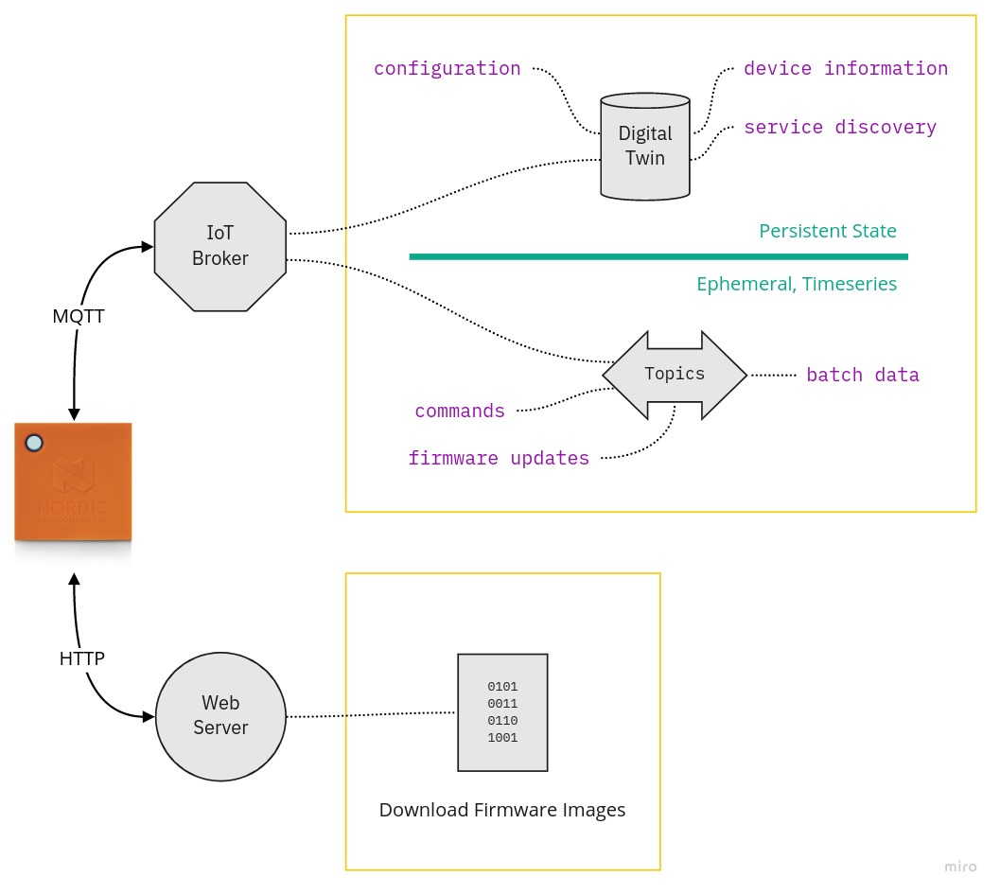
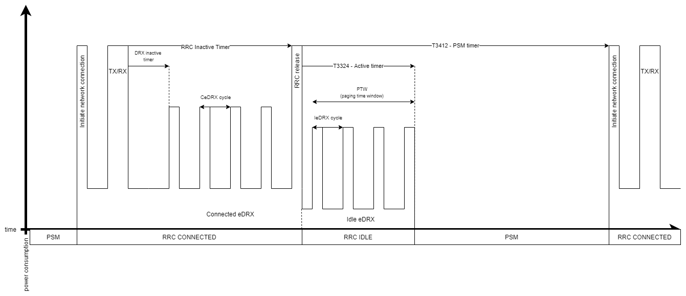
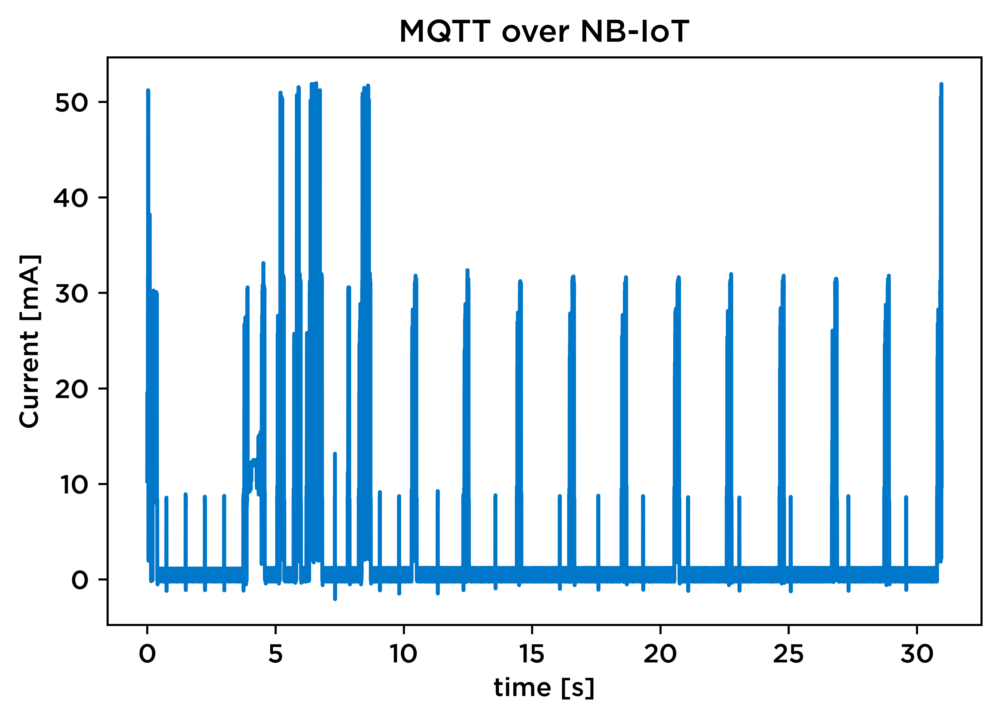
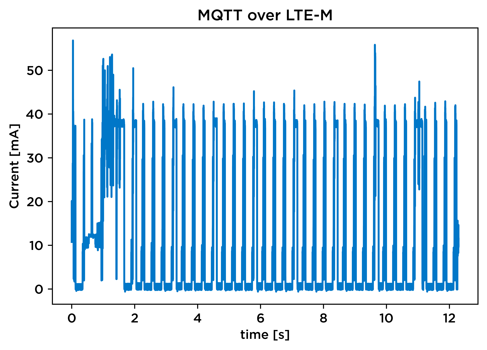
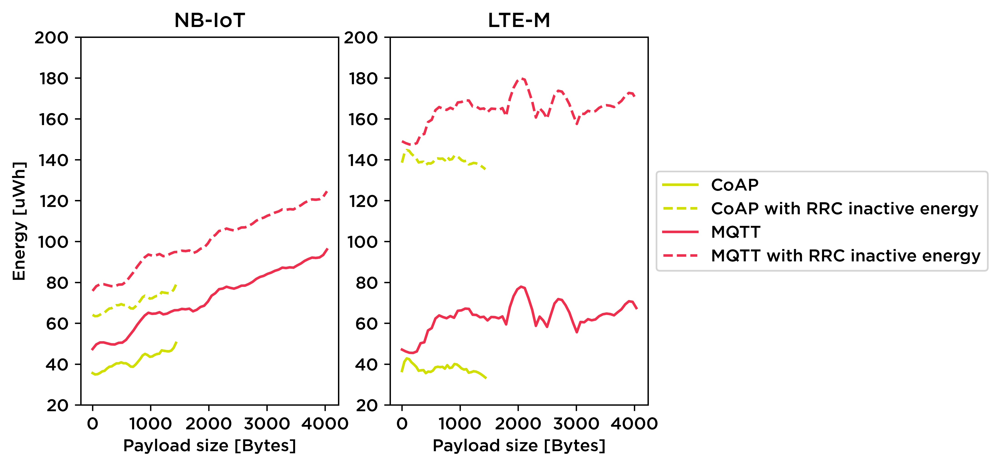
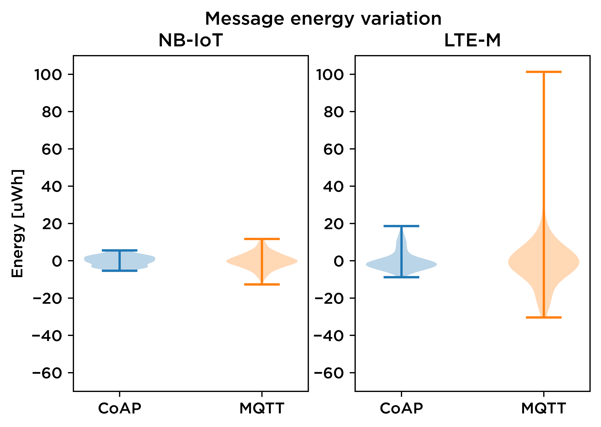
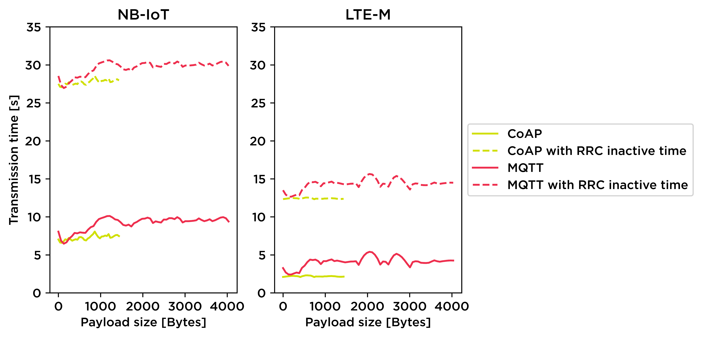
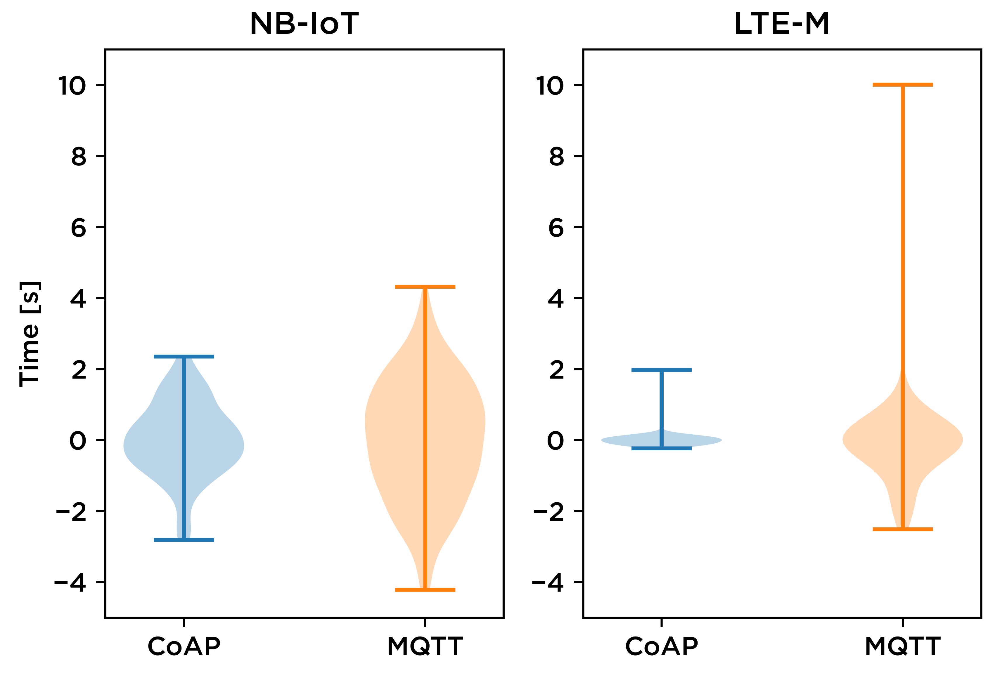

## Speakers

:::::::::::::: {.columns}

::: {.column width="50%"}

{width=35%}

Markus Tacker

**Senior R&D Engineer**  
Nordic Semiconductor

<small>[Markus.Tacker@NordicSemi.no](mailto:Markus.Tacker@NordicSemi.no)  
Twitter: [\@coderbyheart](https://twitter.com/coderbyheart)</small>

:::

::: {.column width="50%"}

{width=35%}

Carl Richard Fosse

**Application Engineer**  
Nordic Semiconductor

<small>[Carl.Fosse@NordicSemi.no](mailto:Carl.Fosse@NordicSemi.no)</small>

:::

::::::::::::::

[#NordicTechWebinars](https://twitter.com/hashtag/NordicTechWebinars)

## Agenda

- Application data
- Data protocols
- Transport protocols
- How to measure data usage
- Wireless radio protocols
- Energy consumption considerations
- Summary
- Ways to your first proof-of-concept

## Application data

{width=50%}

Typical IoT Data Protocol Configuration

:::notes

[Source](https://miro.com/app/board/o9J_kjPVxw8=/)

What you see here is a typical configuration for cellular IoT devices.

:::

### The four kinds of data

1. Device State
1. Device Configuration
1. Past Data
1. Firmware Updates

### 1. Device State

- **sensor readings** (like position, temperature)
- information about its **health** (like battery level)

Because the latest state should be immediately visible: buffer data in a
_Digital&nbsp;Twin_.

:::notes

A device needs to send its sensor readings (like position, temperature) and
information about its health to the backend, first an foremost is the battery
level a critical health indicator. This data is considered the device state.

Because we want to always be able to quickly see the latest state of the device,
a digital twin can be used to store this state on the backend side: whenever the
device sends an update, the digital twin is updated. This allows an application
to access the most recent device state immediately without needing to wait for
the device to connect and publish its state.

:::

### Update Device State only if needed

- implement situational awareness on the device
- only send **relevant** data
  - did a sensor reach a critical threshold?
  - has enough time passed since last update?
  - is the connection good enough?

:::notes

It is an important criterion for the robustness of any IoT product to gracefully
handle situations in which the device is not connected to the internet. It might
even not be favorable to be connected all the time—wireless communication is
relatively expensive consumes a lot of energy and therefore increases the power
consumption.

> To optimize for ultra-low power consumption, we want to turn off the modem as
> quickly as possible and keep it off as long as possible.

This can be achieved by making the device smart and allowing it to decide based
on the situation whether it should try to send data.

For example could an asset tracker use the motion sensor to decide whether to
publish its state frequently or if it detects no movement for a while go into a
passive mode, where it turns of the modem and waits until it detects movement
again. It could also use the internal clock to wake up every hour to sent a
heartbeat, after all we might want to know that the device is healthy, even it
is not in motion.

:::

### 2. Device Configuration

- change behaviour of device in real time (e.g. sensor sensititiy, timeouts)
- configure physical state (e.g. _locked_ state of a door lock)

:::notes

Depending on the product we might also want to change the device configuration.
This could on the one hand be use during development to tweak the aforementioned
behavior using variables instead of pushing a new firmware over the air to the
device. We observe firmware sizes of around 250 KB which will, even when
compressed, be expensive because it will take a device some time to download and
apply the updated, not to mention the costs for transferring the firmware update
over the cellular network. Especially in NB-IoT-only deployments is the data
rate low. Updating a fleet of devices with a new firmware involves orchestrating
the roll-out and observing for faults. All these challenges lead to the need to
be able to **configure the device**, which allows to tweak the behavior of the
device until the inflection point is reached: battery life vs. data granularity.
Interesting configuration options are for example the sensitivity of the motion
sensor: depending on the tracked subject what is considered "movement" can vary
greatly. Various timeout settings have an important influence on power- and
data-consumption: the time the device waits to acquire a GPS fix, or the time it
waits between sending updates when in motion.

On the other hand is device configuration needed if the device controls
something: imaging a smart lock which needs to manipulate the state of a
physical lock. The backend needs a way to tell the device which state that lock
should be in, and this setting needs to be persisted on the backend, since the
device could lose power, crash or otherwise lose the information if the lock
should be open or closed.

Here again is the digital twin used on the cloud side to store the latest
desired configuration of the device immediately, so the application does not
have to wait for the device to be connected to record the configuration change.
The implementation of the digital twin then will take care of sending only the
latest required changes to the device (all changes since the device did last
request its configuration are combined into one change) thus also minimizing the
amount of data which needs to be transferred to the device.

:::

### 3. Past Data

Cellular IoT devices need to send **data about past events**: they will be
offline most of the time.


:::notes

[Source](https://www.telenor.no/privat/dekning/)

Imagine a reindeer tracker which tracks the position of a herd. If position
updates are only collected when a cellular connection can be established there
will be an interesting observation: the reindeers are only walking along ridges,
but never in valleys. The reason is not because they don't like the valley, but
because the cellular signal does not reach deep down into remote valleys. The
GPS signal however will be received there from the tracker because satellites
are high on the horizon and can send their signal down into the valley.

There are many scenarios where cellular connection might not be available or
unreliable but reading sensors work. Robust ultra-mobile IoT products therefore
must make this a normal mode of operation: the absence of a cellular connection
must be treated as a temporary condition which will eventually resolve and until
then business as usual ensues. This means devices should keep measuring and
storing these measures in a ring-buffer or employ other strategies to decide
which data to discard once the memory limit is reached.

Once the device is successfully able to establish a connection it will then
(after publishing its most recent measurements) publish past data in batch.

On a side note: the same is true for devices that control a system. They should
have built-in decision rules and must not depend on an answer from a cloud
backend to provide the action to execute based on the current condition.

:::

### 4. Firmware Updates

- 2-3 magnitudes larger than a control message (~250 KB)
- notification via control channel (MQTT)
- download via data channel (HTTP): less overhead, supports resume

:::notes

Arguably a firmware update over the air can be seen as configuration, however
the size of a typical firmware image (250 KB) is 2-3 magnitudes larger than a
control message. Therefore it can be beneficial to treat it differently.
Typically an update is initiated by a configuration change, once acknowledged by
the device will initiate the firmware download. The download itself is done out
of band using not MQTT but HTTP(s) to reduce overhead.

Additionally firmware updates are so large compared to other messages that the
device may suspend all other operation until the firmware update has been
applied to conserve resources.

:::

### Summary: Application data

- **great potential for optimization**
- **initiating and maintaining network connection is magnitudes more expensive**
  compared to other device operations (for example reading a sensor value)
- **invest a substantial amount** into optimizing these when developing an
  **ultra-low power product**

:::notes

It's these messages that are exchanged between your devices and your backend
which are the most important aspect to optimize for when developing an ultra-low
power product because initiating and maintaining network connection is
relatively expensive compared to other device operations (for example reading a
sensor value).

It is therefore recommended to invest a substantial amount of time to revisit
the principles explained here and customize them to your specific needs. The
more the modem-uptime can be reduced and the smaller the total transferred
amount of data becomes, the longer your battery will last.

:::

## Data protocols

- JSON
- Alternatives to JSON
  - Flatbuffers
  - CBOR

:::notes

Let's look at the "default" protocol for encoding Application data and what
alternatives exist to reduce the amount of data needed to transmit a typical
device message: a GPS location.

:::

### JSON

```json
{
  "v": {
    "lng": 10.414394,
    "lat": 63.430588,
    "acc": 17.127758,
    "alt": 221.639832,
    "spd": 0.320966,
    "hdg": 0
  },
  "ts": 1566042672382
}
```

"default" data protocol for IoT
([AWS](https://docs.aws.amazon.com/iot/latest/developerguide/iot-device-shadows.html),
[Azure](https://docs.microsoft.com/en-us/azure/iot-hub/iot-hub-devguide-device-twins),
[Google Cloud](https://cloud.google.com/iot/docs/how-tos/config/getting-state#api))

:::::::::::::: {.columns}

::: {.column width="50%"}

👍 human readable  
👍 schema-less (self-describing)

:::

::: {.column width="50%"}

👎 overhead

:::

::::::::::::::

:::notes

JSON offers very good support in tooling and is human readable. Especially
during development its verbosity is valuable.

:::

### Possible Optimizations

GPS location message

:::::::::::::: {.columns}

::: {.column width="50%"}

```json
{
  "v": {
    "lng": 10.414394,
    "lat": 63.430588,
    "acc": 17.127758,
    "alt": 221.639832,
    "spd": 0.320966,
    "hdg": 0
  },
  "ts": 1566042672382
}
```

:::

::: {.column width="50%"}

<br/>

```
02 36 01 37 51 4b 73 2b
d4 24 40 09 68 06 f1 81
1d b7 4f 40 11 68 cd 8f
bf b4 20 31 40 19 e6 5d
f5 80 79 b4 6b 40 21 1a
30 48 fa b4 8a d4 3f 29
00 00 00 00 00 00 00 00
09 00 e0 cf ac f6 c9 76
42
```

:::

::::::::::::::

:::::::::::::: {.columns}

::: {.column width="50%"}

JSON  
114 bytes  
<small>without newlines</small>

:::

::: {.column width="50%"}

Protocol Buffers  
65 bytes (-42%)  
<small>[source](https://gist.github.com/coderbyheart/34a8e71ffe30af882407544567971efb)</small>

:::

::::::::::::::

:::notes

Consider this GPS message. It contains a lot of data which is intended for
humans, but not needed for machines sending or receiving the data.

The pure binary message would be transmitting only the 6 floats and 1 integer of
the message. However a strucured message format is always preferred because we
also want to ensure its integrity.

In JSON notation this document (without newlines) has 114 bytes. If the message
were to be transferred using for example Protocol Buffers the data can be
encoded with only 65 bytes (a 42% improvement).

See also:
[RION Performance Benchmarks](http://tutorials.jenkov.com/rion/rion-performance-benchmarks.html)

:::

### Flatbuffers

[google.github.io/flatbuffers](https://google.github.io/flatbuffers/)

- evolution of
  [Protocol Buffers](https://developers.google.com/protocol-buffers)
- **access a buffer without parsing**
- smaller library,
  [C implementation exists](https://github.com/dvidelabs/flatcc)
- wire format size
  [a little bigger](http://google.github.io/flatbuffers/flatbuffers_benchmarks.html)
  compared to Protocol Buffers
- schema-less (self-describing) messages are supported
- **NOT** supported in Zephyr/NCS

:::notes

In the comparison on the previous slide we showed how using Protocol Buffers can
dramatically reduce the transferred data size, while keeping a typed message.

The implementation of Protocol Buffers is however quite big (for a resource
constrained device like the nRF9160), and no official encoder/decoder
implementation exists for C,
[inofficial does](https://github.com/protobuf-c/protobuf-c).

Flatbuffers is the best candidate with similar data savings.

Especially the ability to access members of a message directly in place makes it
ideal for memory-constrained devices: no need to create a second copy of the
received values.

It also offers flexibility during development is also supported because
FlatBuffers offers a schema-less (self-describing) version.

Unfortunately there is no official support in the nRF Connect SDK or Zephyr as
of now.

:::

### CBOR

[cbor.io](https://cbor.io/)

- maps JSON to binary structures
- zero configuration needed between exchanging parties
- support in Zephyr ([tinycbor](https://github.com/zephyrproject-rtos/tinycbor))

:::notes

Therefore the best alternative to JSON right now is CBOR.

CBOR is standard for encoding JSON data in a set of binary structures. It
reduces volume by using more compact one byte values to replace two or more
punctuation marks.

Official support is available in Zephyr.

:::

### CBOR: example

GPS location message

:::::::::::::: {.columns}

::: {.column width="50%"}

```json
{
  "v": {
    "lng": 10.414394,
    "lat": 63.430588,
    "acc": 17.127758,
    "alt": 221.639832,
    "spd": 0.320966,
    "hdg": 0
  },
  "ts": 1566042672382
}
```

:::

::: {.column width="50%"}

<br/>

```
A2 61 76 A6 63 6C 6E 67
FB 40 24 D4 2B 73 4B 51
37 63 6C 61 74 FB 40 4F
B7 1D 81 F1 06 68 63 61
63 63 FB 40 31 20 B4 BF
8F CD 68 63 61 6C 74 FB
40 6B B4 79 80 F5 5D E6
63 73 70 64 FB 3F D4 8A
B4 FA 48 30 1A 63 68 64
67 00 62 74 73 1B 00 00
01 6C 9F 6A CC FE
```

:::

::::::::::::::

:::::::::::::: {.columns}

::: {.column width="50%"}

JSON  
114 bytes  
<small>without newlines</small>

:::

::: {.column width="50%"}

CBOR  
86 bytes (-24%)  
<small>[source](http://cbor.me/)</small>

:::

::::::::::::::

:::notes

This shows the possible savings when encoding the GPS location message using
CBOR.

:::

### Summary: Data protocols

Look into denser data protocols!  
**JSON is for Humans.**

- devices always™ send the same structure:  
  no need to transmit it
- less data to send
  - less money spent on data (grows linear with № of devices)
  - less energy consumed = longer device lifetime
  - lower chance of failed transmit

## Transport protocols

- MQTT+TLS
- MQTT-SN+(D)TLS
- CoAP/LWM2M+(D)TLS

### MQTT+TLS

common protocol for "ecommerce" cloud vendors  
([AWS](https://docs.aws.amazon.com/iot/latest/developerguide/protocols.html),
[Azure](https://docs.microsoft.com/en-us/azure/iot-hub/iot-hub-devguide-protocols),
[Google Cloud](https://cloud.google.com/iot/docs/concepts/protocols))

- great fit for asynchronous, event oriented communication: MQTT is
  bidirectional pub/sub model
- overhead:
  - topic name in every MQTT package  
    № of topics per device: ~3
  - TLS handshake with AWS IoT broker: ~10 KB
- Supported out of the box in nRF Connect SDK

:::notes

MQTT with TLS is the default protocol when using IoT offerings from "ecommerce"
cloud vendors like Amazon, Microsoft or Google. It's a great fit for the
event-driven communication in IoT and allows both sides to initiate
communication.

However the protocol overhead for both MQTT and TLS are substantial: the initial
handshake is large, and then every MQTT package contains repeated information.
The MQTT topic name is quite long (typical size is around 60 Byte), which could
actually be omitted.

:::

### MQTT-SN+(D)TLS

[MQTT-SN 1.2 Specification](https://www.oasis-open.org/committees/document.php?document_id=66091)

- optimized version designed specifically IoT
- supports UDP
- use numeric IDs instead of strings for topic names
- better offline support
- **not supported** out of the box in nRF Connect SDK
- **not supported** by cloud vendors: needs a (stateful) Gateway

:::notes

MQTT-SN was specifically designed for IoT devices and tries to address the
issues mentioned earlier.

The main differences involve:

- Reducing the size of the message payload
- Removing the need for a permanent connection by using UDP as the transport
  protocol.

:::

### CoAP/LWM2M+(D)TLS

- common protocol in Telco clouds (Verizon’s Thingspace, AT&T’s IoT Platform)
- typically used for device management (carrier library)
- support in nRF Connect SDK
  ([CoAP client sample](https://developer.nordicsemi.com/nRF_Connect_SDK/doc/latest/nrf/samples/nrf9160/coap_client/README.html),
  [LwM2M client sample](https://developer.nordicsemi.com/nRF_Connect_SDK/doc/latest/nrf/samples/nrf9160/lwm2m_client/README.html))
- **not supported** by cloud vendors: needs a (stateful) Gateway.  
  Proof-of-concept AWS IoT-LwM2M Gateway:
  [github.com/coderbyheart/leshan-aws](https://github.com/coderbyheart/leshan-aws)

:::notes

This protocol is mostly used for device management. Especially LwM2M comes with
a large set of predefined operations (e.g. firmware update) and uses very
lightweight messaging. It also supports UDP out of the box which makes it an
ideal protoco for resource constraint devices.

However there is no out-of-the box support by ecommerce cloud vendors, so here
again one needs to operate a Gateway.

:::

## How to measure data usage

- measure during development already: important input on picking the right
  connectivity partner
- measuring at multiple endpoints tricky (MQTT + HTTP), does not measure failed
  transmits
- nRF9160 modem provides
  [connectivity statistics](https://infocenter.nordicsemi.com/index.jsp?topic=%2Fref_at_commands%2FREF%2Fat_commands%2Fmob_termination_ctrl_status%2Fxconnstat.html)

:::notes

One of the biggest cost factors when operating a cellular IoT product are data
transfers. Not only are prices for IoT connectivity multiple magnitudes more
expensive to what we are used from smartphone contracts, but transmitting data
also requires a lot of energy. The longer the devices needs to transmit a
payload the more likely it is also that the connection deteriorates (especially
when the device is moving) and re-transmits need to happen. Therefore it is
important to pay close attention to the amount of data your product is sending
from the beginning. Having knowledge about the data usage profile of your
application at hand also becomes important when picking the right connectivity
partner.

While it is possible to infer a device's data consumption on the terminating
endpoint, this information is not accurate, because it can observe successfully
incoming messages. It can also become challenging to cover all endpoints, for
example Firmware over the Air updates are typically downloaded via HTTPs from a
web server and not through MQTT.

:::

### Enable connectivity statistics

Use `AT%XCONNSTAT=1` to tell the modem to start collecting connectivity
statistics

```c
#include <modem/at_cmd.h>

int err = at_cmd_write("AT%XCONNSTAT=1", NULL, 0, NULL);
if (err != 0) {
	printk("Could not enable connection statistics, error: %d\n", err);
}
```

### Read current connectivity statistics

Use `AT%XCONNSTAT?` to read the current connectivity statistics

```c
static struct k_delayed_work connstat_work;

static int query_modem(const char *cmd, char *buf, size_t buf_len) { ... }

static void connstat_work_fn(struct k_work *work)
{
	query_modem("AT%XCONNSTAT?", connStatBuffer, sizeof(connStatBuffer));
	// NOTE: k_uptime_get_32() cannot hold a system uptime time
	// larger than approximately 50 days
	printk("Connection stats: %s | Uptime: %d seconds\n",
		connStatBuffer, k_uptime_get_32() / 1000);
	// Schedule next run
	k_delayed_work_submit(&connstat_work, K_SECONDS(60));
}

k_delayed_work_init(&connstat_work, connstat_work_fn);
k_delayed_work_submit(&connstat_work, K_SECONDS(60));
```

<small>You can see a full diff of how I added this to one of my applications
[here](https://github.com/coderbyheart/nRF9160-temperature-controlled-relay/commit/d0c43bb5c11347987ce61c84c695e17eb38f39cd).</small>

### Connectivity statistics output

    Connection stats: %XCONNSTAT: 0,0,14,16,748,134 | Uptime: 5041 seconds

#### Syntax

    %XCONNSTAT: <SMS Tx>,<SMS Rx>,<Data Tx>,<Data Rx>,<Packet max>,<Packet average>

1. SMS Tx: total number of SMSs successfully transmitted
1. SMS Rx: total number of SMSs successfully received
1. **Data Tx: total amount of data (in kilobytes) transmitted**
1. **Data Rx: total amount of data (in kilobytes) received**
1. Packet max: maximum packet size (in bytes) used
1. Packet average: average packet size (in bytes) used

:::notes

Now you have access to the connectivity statistics, and can for example publish
this to the cloud every hour so you can collect precise data consumption usage
from your devices. Together with the uptime information collected on the device
you will be able to develop a very good understand of what the typical data
usage per day, week and month will be for your devices.

[See this blog post](https://devzone.nordicsemi.com/nordic/cellular-iot-guides/b/software-and-protocols/posts/monitoring-nrf9160-data-usage-with-connectivity-statistics)

:::

## Wireless radio protocols


:::notes

The nRF9160 supports two cellular networking protocols: LTE-M and NB-IoT.
Fundamentally they both provide IP connectivity to your device, however they are
significant differences, which are important to consider when developing your
IoT product.

See
[this comparison](https://www.nordicsemi.com/Products/Low-power-cellular-IoT)

:::

### 

- 375 kbps downlink, 300 kbps uplink
- ~100 kbps application throughput running IP
- supports roaming (same as LTE)
- typically uses frequency bands above 2 Ghz
- ms-latency

:::notes

LTE-M (also known as Cat-M1) is designed for low power applications requiring
medium throughput. It has a narrower bandwidth of 1.4 MHz compared to 20 MHz for
regular LTE, giving longer range, but less throughput. The throughput is 375
kbps downlink and 300 kbps uplink, providing approximately 100 kbps application
throughput running IP. It is suitable for TCP/TLS end-to-end secure connections.
Mobility is fully supported, using the same cell handover features as in regular
LTE. It is currently possible to roam with LTE-M, meaning it is suitable for
applications that will operate across multiple regions. The latency is in the
millisecond range offering real time communication for time-critical
applications.

:::

### 

- 60 kbps downlink, 30 kbps uplink
- typically uses frequency bands below 2 Ghz
- no roaming support (some Telcos do offer custom solution)
- good indoor/underground penetration characteristics
- long range

:::notes

NB-IoT (also known as Cat-NB1) is a narrowband technology standard that does not
use a traditional LTE physical layer, but is designed to operate in or around
LTE bands and coexist with other LTE devices. It has a bandwidth of 200 kHz,
giving it longer range and lower throughput compared to LTE-M and regular LTE.
The throughput is 60 kbps downlink and 30 kbps uplink. It is suitable for
static, low power applications requiring low throughput.

:::

### Comparison

:::::::::::::: {.columns}

::: {.column width="50%"}

#### LTE-m

<small>for medium throughput applications requiring low power, low latency
and/or mobility</small>

- asset tracking
- wearables
- medical
- POS
- home security

:::

::: {.column width="50%"}

#### NB-IoT

<small>for static, low throughput applications requiring low power and long
range</small>

- smart metering
- smart agriculture
- smart city

:::

::::::::::::::

:::notes

LTE-M is perfect for medium throughput applications requiring low power, low
latency and/or mobility, like asset tracking, wearables, medical, POS and home
security applications.

NB-IoT is perfect for static, low throughput applications requiring low power
and long range, like smart metering, smart agriculture and smart city
applications. It also provides better penetration in, for example, cellars and
parking garages compared to LTE-M.

:::

## Energy consumption considerations

<small>Carl Richard Fosse</small>

:::notes

Low power operation is key for many IoT devices Application protocols on
cellular devices like the nRF9160

:::

### My master thesis research

_“Power Consumption modeling of TCP and UDP over low power cellular networks for
a constrained device”_

- TCP represented by MQTT
- UDP represented by CoAP
- Tested both protocols over NB-IoT and LTE-M, using the nRF9160.
- Used the data to empirically model the power consumption of the device.

:::notes

Last spring, before starting at Nordic Titled “Power Consumption modeling of TCP
and UDP over low power cellular networks for a constrained device”, where I
compared TCP and UDP over LTE-M and NB-IoT using the nRF9160.

Used the data to model energy consumption given parameters like payload size and
transmission interval.

Will talk about findings and observations.

:::

### Experiment setup: Components

- Hardware: nRF9160DK v0.8.5
- SDK: v1.2.0
- Measurement unit: Otii ARC
- Network provider: Telenor LTE-M and NB-IoT

- Power measurement setup will be more thoroughly covered in our webinar the 9th
  of December.

:::notes

- Quick runthrough
- nRF9160DK version 0.8.5
- nRF Connect SDK version 1.2
- Otii ARC for current measurement
- The Norwegian network provider Telenor and their LTE-M and NB-IoT networks

:::

### Experiment setup: Firmware

- One application for MQTT and one for CoAP  
  <small>(available on [GitHub](https://github.com/crfosse/dt_app))</small>
- Long PSM interval with regular transmissions and increasing payload
- Average sleep current ~200µA

:::notes

- Two applications
- Regular transmissions
- Both using the Power Saving Mode feature defined for LTE-M and NB-IoT.
- The PSM specification allows for a device to initiate transmissions during the
  defined PSM interval.
- A long PSM interval was used to avoid other wakeups than those initiated by
  regular transmissions.
- Did not focus on optimizing the power consumption performance of the
  applications.
- Rather wanted to focus on how the protocols performed with relation to
  eachother.

:::

### Energy consumption factors: Application protocols

- Establishment of connection
  - Especially relevant for TCP
- Acknowledgements
- Payload size
- Protocol defined limits
  - Maximum transmission unit (MTU)
  - Maximum segment size (MSS)

### Energy consumption factors: Cellular network

- Connection
- RRC inactive timer
- Reception quality

- Additional parameters - see the Online Power Profiler

:::notes

- Short summary of important factors affecting the energy consumption of a
  cellular device
- Connection establishment is relevant on application protocol level and for
  cellular networks
- TCP has persistent connection, requiring more traffic
- To enable reliable communication acknowledgements are important.
- They lead to unpredictable behavior as well as more traffic
- There are many limits imposed by different protocols
- MTU from IP and Ethernet
- MSS on TCP to avoid IP fragmentation

- Connecting to the cellular network is costly. PSM lowers the cost.
- With PSM the devices stays active during an RRC inactive countdown consuming
  power. (network defined)

- Test and read about additional parameters in our online power profiler

:::

### Time diagram



:::notes

- Example diagram of a transmission.
  - Exits PSM and reconnects
- Transmits
- Stays active.
  - Last part is active timer. Only relevant if you expect data to be received.
- Not used in my research.

:::

### In reality

:::::::::::::: {.columns}

::: {.column width="50%"}



:::

::: {.column width="50%"}



:::

::::::::::::::

:::notes

Example transmissions for MQTT over LTE-M and NB-IoT. Notice where the
transmission is finished and inactive countdown starts. Very different on the
LTE-M and NB-IoT LTE-M has higher peaks and more frequent activity, which in
turn affects the power consumption.

:::

### Some results

### Transmission energy



:::notes

- Averaged out plots for energy used on transmission
- Dashed line – with RRC inactive
- Solid line – without RRC inactive energy
- The RRC inactive energy is dependent on network provider and was therefore not
  considered
- Notice how much it contributes to the total energy consumed

- NB-IoT is linearly dependent on payload size.
- LTE-M, with higher capacity, is not. Within the tested payload size range.
- Some outliers for TCP over LTE-M resulting in energy consumption spikes.
  Restarting of RRC inactive timer due to activity

- CoAP in general use less energy than MQTT.
- Mentioned MSS earlier. These results evidently shows how this affects energy
  consumption
- For MQTT on both LTE-M and NB-IoT there is an increase in consumed power after
  payload exceeds ~500 bytes
- The base MSS is 536 bytes.

Note at last that there is a starting cost to every transmission.

:::

### Transmission energy

{width=60%}

:::notes

- Violin plots showing variation and distribution of measurements, based on
  residuals from regression analysis.
- Small for NB-IoT
- More spurious for LTE-M

:::

### Transmission time



:::notes

Plot of transmission time. The dashed line shows how long the device stays
active in total

- LTE-M is as expected faster than NB-IoT.
- Not a strong correlation for any of them with payload size
- Notice that the MSS affects time used on transmission aswell

:::

### Transmission time variation

{width=60%}

:::notes

- Violin plots of variation and distribution of transmission time measurements
- NB-IoT is wide and latent.
- LTE-M especially for CoAP has a low variation.

:::

### Important observations: Application protocols

- MQTT
  - TCP is not ideal for low power applications
  - MQTT is a popular and well supported protocol
- CoAP
  - Less overhead compared to MQTT
  - Enables reliable UDP
  - Not that popular

:::notes

- MQTT is well supported, but TCP is not ideal for low power use. We saw more
  spurious timing and energy consumption
- CoAP has less overhead, supports reliability, but is not very popular(yet?)

:::

### Important observations: Cellular standards

- LTE-M
  - High speed, high capacity
  - Power consumption not correlated with payload size
  - More “spurious” energy consumption
- NB-IoT
  - Slow, low capacity
  - Energy consumption is linearly dependent with payload size

:::notes

- LTE-M and NB-IoT are as expected suited for different purposes.
- LTE-M saw higher peak currents as well as some spurious behavior during the
  inactive countdown.
- When transmitting large amounts of data on a network that provides a short
  inactive countdown LTE-M can actually outperform NB-IoT in terms of power
  consumption.
- Due to the linear dependency of NB-IoT with relation to payload size.

:::

### Transfer large amounts of data rarely

rather than small amounts often.

## Summary

- no silver bullet - multiple _conflicting_ dimensions need to be considered
- highly depends on use case scenario
- ultra-low power relevant in all scenarios

:::notes

:::

## Ways to your first proof-of-concept

- nRF Connect for Cloud
- Bifravst

:::notes

Now, if you want to get started with developing your cellular IoT product here
are some resources...

:::

### nRF Connect for Cloud

- cloud resources (AWS) provided by us
- our
  [cellular IoT Development Kits](https://www.nordicsemi.com/Software-and-tools/Development-Kits)
  are preconfigured to connect
- you can focus on modifying the
  [sample application](https://developer.nordicsemi.com/nRF_Connect_SDK/doc/1.3.2/nrf/applications/asset_tracker/README.html)
  - [Building NCS applications with Docker](https://github.com/coderbyheart/fw-nrfconnect-nrf-docker#using-pre-built-image-from-dockerhub)
    in ~2 minutes

{width=10%}  
<small>[nrfcloud.com](https://nrfcloud.com/)</small>

:::notes

nRF Connect for Cloud is an integral part of you cellular IoT development
workflow. We have made nRF Connect for Cloud simple to use, yet powerful and
efficient when getting your cellular designs and products connected.

:::

### Bifravst

- concrete end-to-end example for an ultra-low power cellular IoT product in the
  asset tracker space
- end-to-end example: firmware 🡘 cloud 🡘 mobile web app
- runs in your AWS account  
  <small>Azure support
  [in progress](https://github.com/bifravst/bifravst/issues/29)</small>
- fully open-source  
  <small>3-clause BSD license (software) and the Nordic 5-clause BSD license
  (firmware)</small>
- [firmware](https://github.com/bifravst/firmware) developed from ground up with
  power consumption in mind

{width=50%}  
<small>[bifravst.github.io](https://bifravst.github.io/)</small>

:::notes

_Bifravst_ aims to provide a concrete end-to-end example for an ultra-low power
IoT product in the asset tracker space, namely a _Cat Tracker_.

**_Bifravst_ enables the developers to set up a real world IoT solution using
the respective cloud provider and adapt the example firmware and software
quickly for a specific use case.**

_Bifravst_ aims to provide answers and recommend best practices to the following
questions :

- _How can you connect Nordic's cellular IoT chips to your cloud provider?_
- _How do devices send data into the cloud?_
- _How can the data be sent to the devices?_
- _How can users and other services interact with the devices?_
- _How can you update the application firmware of your devices while they are
  deployed in the field?_
- _How can you develop a cellular IoT product that maximizes battery life,
  minimizes data usage, and handles unreliable connectivity gracefully?_

:::

## Thank you & happy connecting!

Please share your feedback!

:::::::::::::: {.columns}

::: {.column width="50%"}

<small>[Markus.Tacker@NordicSemi.no](mailto:Markus.Tacker@NordicSemi.no)  
Twitter: [\@coderbyheart](https://twitter.com/coderbyheart)</small>

:::

::: {.column width="50%"}

<small>[Carl.Fosse@NordicSemi.no](mailto:Carl.Fosse@NordicSemi.no)</small>

:::

::::::::::::::

[#NordicTechWebinars](https://twitter.com/hashtag/NordicTechWebinars)  
[{width=25%}](https://devzone.nordicsemi.com/)

<small>Latest version: [`bit.ly/nwiotp`](http://bit.ly/nwiotp)</small>

:::notes

:::
